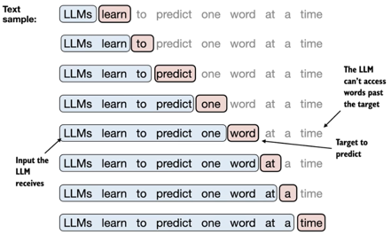

# Homework 2
## The hands-on project for CS441 is divided into three homeworks to build a [Large Language Model (LLM)](https://en.wikipedia.org/wiki/Large_language_model) from scratch. In the first homework students implemented an LLM encoder and computed the embedding vectors of the input text using massively parallel distributed computations in the cloud. The goal of the second homework is to train the decoder using a neural network library as part of a cloud-based computational platform called Spark, so that this trained model can be used to generate text. Later, in the third, final homework students will create an LLM-based generative system using [Amazon Bedrock](https://aws.amazon.com/bedrock) or their own trained LLM to respond to clients' requests using cloud-deployed lambda functions. Much of the background information is based on the book [Build a Large Language Model (From Scratch)](https://github.com/rasbt/LLMs-from-scratch) that provides an example of the LLM implementation in Python and it is available from [Safari Books Online](https://learning.oreilly.com/videos/build-a-large/) that you can access with your academic subscription. All images in this homework description are used from this book.
### The goal of this homework is for students to gain experience with solving a distributed computational problem using cloud computing technologies, specifically, Spark on the AWS EMR.
### Grade: 15%
#### This Git repo contains the homework description that uses an open-source implementation of [deeplearning4j for Spark](https://deeplearning4j.konduit.ai/spark/tutorials/dl4j-on-spark-quickstart) that is a suite of tools for training deep learning models using Spark. 

## Preliminaries
As part of the first homework assignment students learned how to create and manage Git project repository, create an application in Scala, create tests using widely popular Scalatest framework, and expand on the provided SBT build and run script for their applications and they learned a Map/Reduce framework. First things first, if you haven't done so, you must create your account at [Github](https://github.com/), a Git repo management system. Please make sure that you write your name in your README.md in your repo as it is specified on the class roster. Since it is a large class, please use your UIC email address for communications and for signing your projects and you should avoid using emails from other accounts like funnybunny2003@gmail.com. As always, the homeworks class' Teams channel is the preferred way to exchange information and ask questions. If you don't receive a response within a few hours, please contact your TA or the professor by tagging our names. If you use emails it may be a case that your direct emails went to the spam folder.

Next, if you haven't done so, you will install [IntelliJ](https://www.jetbrains.com/student/) with your academic license, the JDK, the Scala runtime and the IntelliJ Scala plugin and the [Simple Build Toolkit (SBT)](https://www.scala-sbt.org/1.x/docs/index.html) and make sure that you can create, compile, and run Java and Scala programs. Please make sure that you can run [various Java tools from your chosen JDK between versions 8 and 22](https://docs.oracle.com/en/java/javase/index.html).

In all homeworks you will use logging and configuration management frameworks and you will comment your code extensively and supply logging statements at different logging levels (e.g., TRACE, INFO, WARN, ERROR) to record information at some salient points in the executions of your programs. All input configuration variables/parameters must be supplied through configuration files -- hardcoding these values in the source code is prohibited and will be punished by taking a large percentage of points from your total grade! You are expected to use [Logback](https://logback.qos.ch/) and [SLFL4J](https://www.slf4j.org/) for logging and [Typesafe Conguration Library](https://github.com/lightbend/config) for managing configuration files. These and other libraries should be imported into your project using your script [build.sbt](https://www.scala-sbt.org).

When creating your Scala applications you should avoid using **var**s and **while/for** loops that iterate over collections using [induction variables](https://en.wikipedia.org/wiki/Induction_variable). Instead, you should learn to use collection methods **map**, **flatMap**, **foreach**, **filter** and many others with lambda functions, which make your code linear and easy to understand as we studied it in class. Also, avoid mutable variables that expose the internal states of your modules at all cost. Points will be deducted for having unreasonable **var**s and inductive variable loops without explanation why mutation is needed in your code unless it is confined to method scopes - you can always do without using mutable states.

## Overview
All three homeworks are created under the general umbrella of a course project that allows students to create and train an LLM using cloud computing tools and frameworks, which is an extremely valuable skill in today's AI-driven economy. The first phase of the project is to build an LLM by preparing and sampling the input data and learning vector embeddings  that is a term designating the conversion of input categorical text data into a vector format of the continuous real values and implement the attention mechanism for LLMs whereas the second phase involves implementing the attention mechanism with a training loop using Spark and evaluating the resulting model. In this homework, you will create a distributed program for parallel processing of the large corpus of data starting with vector embedding.

This and all future homework scripts are written using a retroscripting technique, in which the homework outlines are generally and loosely drawn, and the individual students improvise to create the implementation that fits their refined objectives. In doing so, students are expected to stay within the basic requirements of the homework while free to experiment. Asking questions is important to clarify the requirements or to solve problems, so please ask away at [MS Teams](https://teams.microsoft.com/l/team/19%3A9rv9jqRlilNpSrbWQYfv94QkA-KpnOg3B2xOy7RUpM01%40thread.tacv2/conversations?groupId=60ea78dc-5092-47cd-9117-2bd5a5e35d99&tenantId=e202cd47-7a56-4baa-99e3-e3b71a7c77dd)!

## Functionality
Your homework assignment is to create a program for parallel distributed processing of a large corpus of text and use this program to create a large language model (LLM) based on this text, so that you can then use it to generate text in response to a query. In the first homework you already selected a dataset for your work, so if you haven't done so please consult the description of homework 1. Of course, many datasets are too large for a homework and may require significant computational resources, so students should carve a manageable subset of the data. Previous experiments show that it is possible to build a useful LLM with less than ten gigabytes of data depending on the quality of the data.

The ultimate goal of the homeworks is to produce and use LLMs to generate text using the theory and practice of cloud computing. Let us begin with the end in mind to show how we can use an LLM if it is somehow obtained from the input data. Suppose that one sentence in the text corpus is the following: "the cat sat on the mat." When the user submit the query "the cat" via some RPC invocation it is transmitted to the server that hosts a learned LLM. The query is tokenized and embedded into the vector space of the LLM. Using the method ```argMax``` of the object ```Nd4j``` the model returns the token that has the maximum probability match to follow the words of the query, i.e., the word "sat" and the resulting sentence becomes "the cat sat" and the process continues with the resulting sentence becoming the next input query. Upon completion of the process the resulting generated sentence is likely going to be the original sentence.

In order for this generative process to work the LLM must incorporate parameters or weights that guide the selection of the next word to complete the sentence. We could just use the dot product between the embedding vectors of the query words and all other words in the text corpus as it is done in the basic information retrieval, but the results are atrocious in general. Instead a special mechanism is used called **attention** to incorporate the positions of words in the input to weight the relevancy to all other positions in the same sentence or a bigger context. In our example the word cat is related to the words sat and mat and the previous occurences of the words cat and sat could be used as predictors for the word mat in the same sentence. There are several attention mechanisms and interested students can shop around to choose the ones they like even though it is not important for this homework.

LLMs can be viewed as trained neural networks 

Next, you need to compute the sliding window data samples with the input shifted by one as shown in the example image below. These data samples are based on the tokenized output from the previous step and they contain training data for predicting the final token given a number of previously occuring tokens, e.g., the word *learn* can be predicted by the previous occurence of the word *LLM*. In general, for certain types of embeddings or models, the sliding window is not necessary: if your task is to map individual tokens to vectors without considering their context (e.g., one-hot encoding), you don’t need a sliding window. However, our task is to construct LLM models where we do consider the context! In the context of the first homework the sliding window is superfluous, but we will require it in the next homework



The sliding window algorithm in the context of large language models (LLMs) works to handle long texts that exceed the model's maximum token limit by processing the text in chunks. Here's how it typically functions:
1. Define the Window Size: The model has a maximum number of tokens it can process in one go, say 1024 tokens.
2. Initialize the Window: The first window covers the first 1024 tokens of the input text.
3. Process the Initial Window: The model processes this window to generate output or extract information.
4. Sliding the Window: After processing, the window "slides" forward by a certain number of tokens, typically with some overlap to maintain context. For example, it might move forward by 512 tokens, meaning the next window will cover tokens 513 to 1536.
5. Repeat Until End: This process continues until the window reaches the end of the text.

If the text length is shorter than the maximum token limit, or when the sliding window reaches the end of the text, there are no more tokens to fill the window. Here's how it works:
1. Incomplete Final Window: If there aren't enough tokens left to fill the window completely, the final window may contain fewer tokens than the initial window size. The model processes whatever data remains in this window.
2. Stop Condition: The algorithm detects that there are no more tokens to include in the next window and stops processing. This prevents any further sliding or unnecessary computations.
3. Handling Edge Cases: In cases where the last chunk of text is crucial for context (like summarization or continuation tasks), the overlap between windows ensures that the model retains context from the previous segment, even when the last window is smaller.
   In essence, when there is no more data to slide, the algorithm concludes its processing as it has covered the entire input text.

In the context of constructing an LLM, a [tensor](https://en.wikipedia.org/wiki/Tensor) is a fundamental data structure used to represent multi-dimensional arrays of data. Tensors generalize matrices (2D arrays) to higher dimensions, and are key components in the field of machine learning, particularly in the implementation of neural networks, including LLMs like GPT models. The term [matrix](https://en.wikipedia.org/wiki/Matrix_(mathematics)) is not sufficient since we need to work with data that has more than two dimensions. Matrices are limited to 2D arrays, meaning they have rows and columns. However, in many machine learning and deep learning applications like the one we are creating in this course, especially in neural networks like those used in LLMs, the data is inherently multi-dimensional, requiring more than just rows and columns to represent it. This is where the term tensor becomes necessary.

Consider an input to an LLM where we are processing a batch of sequences of token embeddings. This involves multiple dimensions:
* Batch size: The number of sequences (e.g., sentences or documents) processed simultaneously;
* Sequence length: The number of tokens (words or subwords) in each sequence;
* Embedding size: The dimensionality of the embedding for each token, representing its features (e.g., 512 or 1024 dimensions).

To represent this, we would need a 3D tensor:
* Batch size: N (the number of sequences in a batch);
* Sequence length: L (the number of tokens in each sequence);
* Embedding size: E (the dimensionality of each token's vector).

So, we would represent this data as a tensor of shape (N,L,E). For instance, if:
* N=322 (32 sequences in the batch);
* L=128 (each sequence has 128 tokens);
* E=512 (each token is represented by a 512-dimensional vector).

Hence, we need a tensor of shape (32,128,512), which is a 3D tensor. This goes beyond what a matrix (which can only represent two dimensions) can handle. The term tensor is necessary to describe this multi-dimensional structure.


Your goal is to produce files with token embeddings and various statistics about the data. First, you will compute a Yaml or an CSV file that shows the vocabulary as the list of words, their numerical tokens and the frequency of occurences of these words in the text corpus. Second, for each token embedding you can output other tokens/words that are semantically close them it based on the computed vector embeddings. Finally, you will produce an estimate of the optimal number of dimensions based on your experiments. Determining the optimal number of dimensions (also known as the embedding size or latent vector size) in embedding models involves balancing between capturing enough semantic information and keeping the model computationally efficient. There’s no one-size-fits-all rule, but here are strategies to guide the selection of the optimal number of dimensions, one of which is called a set of word analogy tasks, word similarity tasks, or clustering tasks to see how well the learned vectors capture word relationships. Some datasets like [WordSim-353](https://aclweb.org/aclwiki/WordSimilarity-353_Test_Collection_(State_of_the_art)) or [other datasets](https://github.com/vecto-ai/word-benchmarks) can be used for this purpose.

* Word Analogy: Check how well your embeddings capture relationships like "king" - "man" + "woman" ≈ "queen".
* Word Similarity: Evaluate cosine similarity between known pairs of words (e.g., "cat" and "dog") and see if their embeddings capture the right degree of similarity.

### Assignment for the main textbook group
Your job is to create the mapper and the reducer for each task, explain how they work, and then to implement them and run on the text corpus using your predefined configuration parameters. The output of your map/reduce is a Yaml or an CSV file with token embeddings and the required statistics. The explanation of the map/reduce model is given in the main textbook and covered in class lectures.

You will create and run your software application using [Apache Hadoop](http://hadoop.apache.org/), a framework for distributed processing of large data sets across multiple computers (or even on a single node) using the map/reduce model. Next, after creating and testing your map/reduce program locally, you will deploy it and run it on the Amazon Elastic MapReduce (EMR) - you can find plenty of [documentation online](https://aws.amazon.com/emr). You will produce a short movie that documents all steps of the deployment and execution of your program with your narration and you will upload this movie to [youtube](www.youtube.com) and you will submit a link to your movie as part of your submission in the README.md file. To produce a movie, you may use an academic version of [Camtasia](https://www.techsmith.com/video-editor.html) or Zoom or some other cheap/free screen capture technology from the UIC webstore or an application for a movie capture of your choice. The captured web browser content should show your login name in the upper right corner of the AWS application and you should introduce yourself in the beginning of the movie speaking into the camera. The display of your passwords and your credit card numbers should be avoided when possible :-).

### Assignment for the alternative textbook group
Your job is to create the distributed objects using [omniOrb CORBA framework](http://omniorb.sourceforge.net/omni42/omniORB/) for each task, explain how they work, and then to implement them and run on the generated log message dataset. The output of your distributed system is a Yaml or an CSV file with the required statistics. The explanation of the CORBA is given in the alternative textbook in Chapter 7 -Guide to Reliable Distributed Systems: Building High-Assurance Applications and Cloud-Hosted Services 2012th Edition by Kenneth P. Birman. You can complete your implementation using C++ or Python.

Next, after creating and testing your program locally, you will deploy it and run it on the AWS EC2 IaaS. You will produce a short movie that documents all steps of the deployment and execution of your program with your narration and you will upload this movie to [youtube](www.youtube.com) and you will submit a link to your movie as part of your submission in the README.md file. To produce a movie, you may use an academic version of [Camtasia](https://www.techsmith.com/video-editor.html) or some other cheap/free screen capture technology from the UIC webstore or an application for a movie capture of your choice. The captured web browser content should show your login name in the upper right corner of the AWS application and you should introduce yourself in the beginning of the movie speaking into the camera.

## Baseline Submission
Your baseline project submission should include your implementation, a conceptual explanation in the document or in the comments in the source code of how your mapper and reducer work to solve the problem for Option 1 group or how your CORBA distributed object work for Option 2 group, and the documentation that describe the build and runtime process, to be considered for grading. Your should use [markdown](https://github.com/adam-p/markdown-here/wiki/Markdown-Cheatsheet) for your project's Readme.md. Your project submission should include all your source code as well as non-code artifacts (e.g., configuration files), your project should be buildable using the SBT, and your documentation must specify how you paritioned the data and what input/outputs are.

## Collaboration
You can post questions and replies, statements, comments, discussion, etc. on Teams using the corresponding channel. For this homework, feel free to share your ideas, mistakes, code fragments, commands from scripts, and some of your technical solutions with the rest of the class, and you can ask and advise others using Teams on where resources and sample programs can be found on the Internet, how to resolve dependencies and configuration issues. When posting question and answers on Teams, please make sure that you selected the appropriate channel, to ensure that all discussion threads can be easily located. Active participants and problem solvers will receive bonuses from [the big brother](https://www.cs.uic.edu/~drmark/) :-) who is watching your exchanges. However, *you must not describe your mappers/reducers or the CORBA architecture or other specific details related to how you construct your models!*

## Git logistics
**This is an individual homework.** Please remember to grant a read access to your repository to your TA and your instructor. You can commit and push your code as many times as you want. Your code will not be visible and it should not be visible to other students - your repository should be private. Announcing a link to your public repo for this homework or inviting other students to join your fork for an individual homework before the submission deadline will result in losing your grade. For grading, only the latest commit timed before the deadline will be considered. **If your first commit will be pushed after the deadline, your grade for the homework will be zero**. For those of you who struggle with the Git, I recommend a book by Ryan Hodson on Ry's Git Tutorial. The other book called Pro Git is written by Scott Chacon and Ben Straub and published by Apress and it is [freely available](https://git-scm.com/book/en/v2/). There are multiple videos on youtube that go into details of the Git organization and use.

Please follow this naming convention to designate your authorship while submitting your work in README.md: "Firstname Lastname" without quotes, where you specify your first and last names **exactly as you are registered with the University system**, as well as your UIC.EDU email address, so that we can easily recognize your submission. I repeat, make sure that you will give both your TA and the course instructor the read/write access to your *private forked repository* so that we can leave the file feedback.txt in the root of your repo with the explanation of the grade assigned to your homework.

## Discussions and submission
As it is mentioned above, you can post questions and replies, statements, comments, discussion, etc. on Teams. Remember that you cannot share your code and your solutions privately, but you can ask and advise others using Teams and StackOverflow or some other developer networks where resources and sample programs can be found on the Internet, how to resolve dependencies and configuration issues. Yet, your implementation should be your own and you cannot share it. Alternatively, you cannot copy and paste someone else's implementation and put your name on it. Your submissions will be checked for plagiarism. **Copying code from your classmates or from some sites on the Internet will result in severe academic penalties up to the termination of your enrollment in the University**.


## Submission deadline and logistics
Sunday, September, 29, 2024 at 10PM CST by submitting the link to your homework repo in the Teams Assignments channel. Your submission repo will include the code for the program, your documentation with instructions and detailed explanations on how to assemble and deploy your program along with the results of your program execution, the link to the video and a document that explains these results based on the characteristics and the configuration parameters you chose for your experiments, and what the limitations of your implementation are. Again, do not forget, please make sure that you will give both your TAs and your instructor the read access to your private repository. Your code should compile and run from the command line using the commands **sbt clean compile test** and **sbt clean compile run**. Also, you project should be IntelliJ friendly, i.e., your graders should be able to import your code into IntelliJ and run from there. Use .gitignore to exlude files that should not be pushed into the repo.


## Evaluation criteria
- the maximum grade for this homework is 15%. Points are subtracted from this maximum grade: for example, saying that 2% is lost if some requirement is not completed means that the resulting grade will be 15%-2% => 13%; if the core homework functionality does not work or it is not implemented as specified in your documentation, your grade will be zero;
- only some basic map/reduce or CORBA examples from some repos are given and nothing else is done: zero grade;
- using Python or some other language instead of Scala for the M/R option: 8% penalty;
- homework submissions for an incorrectly chosen textbook assignment option will be desk-rejected with the grade zero;
- having less than five unit and/or integration scalatests: up to 10% lost;
- missing comments and explanations from your program with clarifications of your design rationale: up to 10% lost;
- logging is not used in your programs: up to 5% lost;
- hardcoding the input values in the source code instead of using the suggested configuration libraries: up to 5% lost;
- for each used *var* for heap-based shared variables or mutable collections without explicitly stated reasons: 0.3% lost;
- for each used *while* or *for* or other loops with induction variables to iterate over a collection: 0.5% lost;
- no instructions in README.md on how to install and run your program: up to 10% lost;
- the program crashes without completing the core functionality: up to 15% lost;
- the documentation exists but it is insufficient to understand your program design and models and how you assembled and deployed all components of your mappers and reducers: up to 15% lost;
- the minimum grade for this homework cannot be less than zero.

That's it, folks!
